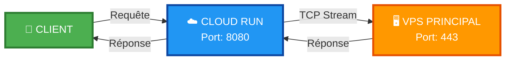
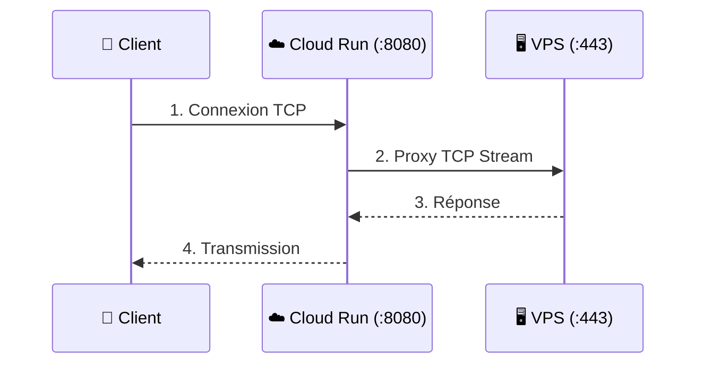

<p align="center">
  
</p>

<p align="center">
  
</p>

<br/>

<div align="center">

# 🌟 Proxy Nginx pour VPS 🌟


</div>

---

## 🚀 **Redirection TCP haute performance vers VPS principal**

<div align="center">
  
</div>

---

## 📊 **Configuration Technique**

<div align="center">

| 🎯 **VPS Cible** | `207.126.161.196:443` |
|:----------------:|:---------------------:|
| 🔌 **Port d'écoute** | `8080` |
| 🌍 **Région VPS** | 🇬🇧 europe-west2 (Londres) |
| ☁️ **Région Cloud Run** | 🇬🇧 europe-west2 (Londres) |
| ⚡ **Type de proxy** | TCP Stream (Layer 4) |

</div>

---

## 🛠️ **Déploiement**

<div align="center">

```bash
gcloud run deploy ultra-speed-proxy \
  --source . \
  --platform managed \
  --region europe-west2 \
  --allow-unauthenticated \
  --port 8080 \
  --memory 512Mi \
  --cpu 1 \
  --timeout 3600
```

</div>

---

✨ Caractéristiques

<div align="center">

🚀 PERFORMANCE 🔒 SÉCURITÉ ⚡ OPTIMISATION
Faible latence Stream TCP 512Mi mémoire
Haut débit Layer 4 proxy 1 CPU vCPU
Timeout 3600s Non authentifié Auto-scaling

</div>

---

🌊 Architecture du flux

<div align="center">



</div>

<div align="center">
  
</div>

---

📈 Statut & Monitoring

<div align="center">
  
  
  
  <br><br>
  
  
  
</div>

---

🎯 Comment ça marche ?

<div align="center">



</div>

---

🔧 Configuration Nginx

```nginx
stream {
    upstream vps_backend {
        server 207.126.161.196:443 max_fails=3 fail_timeout=30s;
    }
    
    server {
        listen 8080;
        proxy_pass vps_backend;
        proxy_connect_timeout 60s;
        proxy_timeout 3600s;
    }
}
```

---

🤝 Contribution

<div align="center">
  <table>
    <tr>
      <td align="center">
        <h3>📝 Comment contribuer ?</h3>
        <br/>
        1. 🍴 Fork le projet<br/>
        2. 🌿 Crée ta branche (<code>git checkout -b feature/AmazingFeature</code>)<br/>
        3. 💾 Commit tes changements (<code>git commit -m 'Add AmazingFeature'</code>)<br/>
        4. 📤 Push la branche (<code>git push origin feature/AmazingFeature</code>)<br/>
        5. 🔃 Ouvre une Pull Request<br/>
        <br/>
        
      </td>
    </tr>
  </table>
</div>

---

📝 Licence

<div align="center">
  
  <br/><br/>
  Distribué sous licence <b>MIT</b>. Voir le fichier <code>LICENSE</code> pour plus d'informations.
</div>

---

👨‍💻 Auteur

<div align="center">
  <table>
    <tr>
      <td align="center">
        <br/>
        <sub><b>WorldSolutionRdc</b></sub>
      </td>
      <td>
        <b>🌐 GitHub :</b> <a href="https://github.com/WorldSolutionRdc">@WorldSolutionRdc</a><br/>
        <b>📧 Email :</b> worldsolutiontv@gmail.com<br/>
        <b>🚀 Projets :</b> Solutions haute performance
      </td>
    </tr>
  </table>
</div>

---

🙏 Remerciements

<div align="center">
  <table>
    <tr>
      <td align="center">
        🎭 <b>PANCHO7532</b><br/>
        <sub>Proxy Bridge original</sub>
      </td>
      <td align="center">
        🔐 <b>BadVPN</b><br/>
        <sub>Tunneling UDP/TCP</sub>
      </td>
      <td align="center">
        🔒 <b>stunnel</b><br/>
        <sub>Couche TLS/SSL</sub>
      </td>
      <td align="center">
        🖥️ <b>Dropbear</b><br/>
        <sub>Serveur SSH léger</sub>
      </td>
    </tr>
    <tr>
      <td align="center" colspan="4">
        ☁️ <b>Google Cloud Run</b><br/>
        <sub>Infrastructure serverless</sub>
      </td>
    </tr>
  </table>
</div>

---

<div align="center">
  
</div>

<br/>

<div align="center">
  
</div>

<br/>

<p align="center">
  
</p>
```

